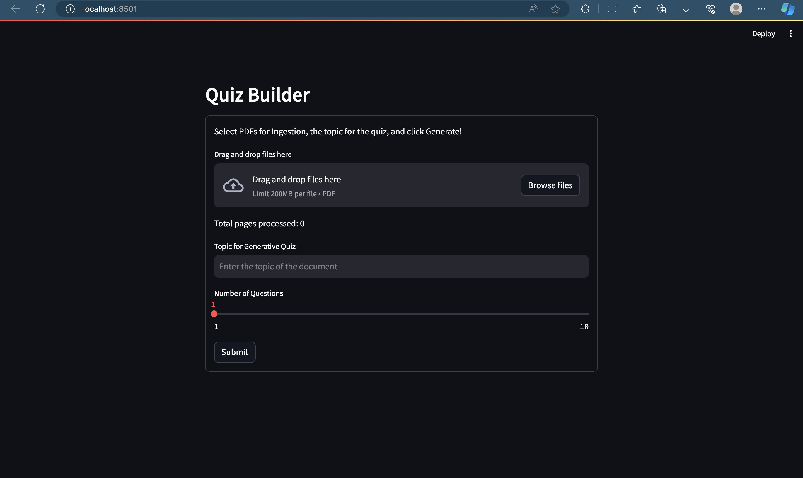
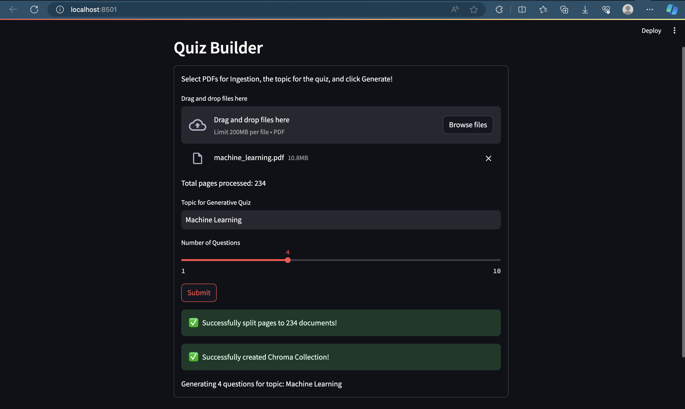
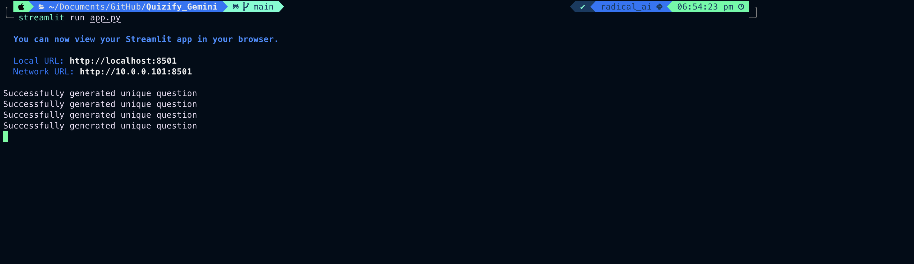
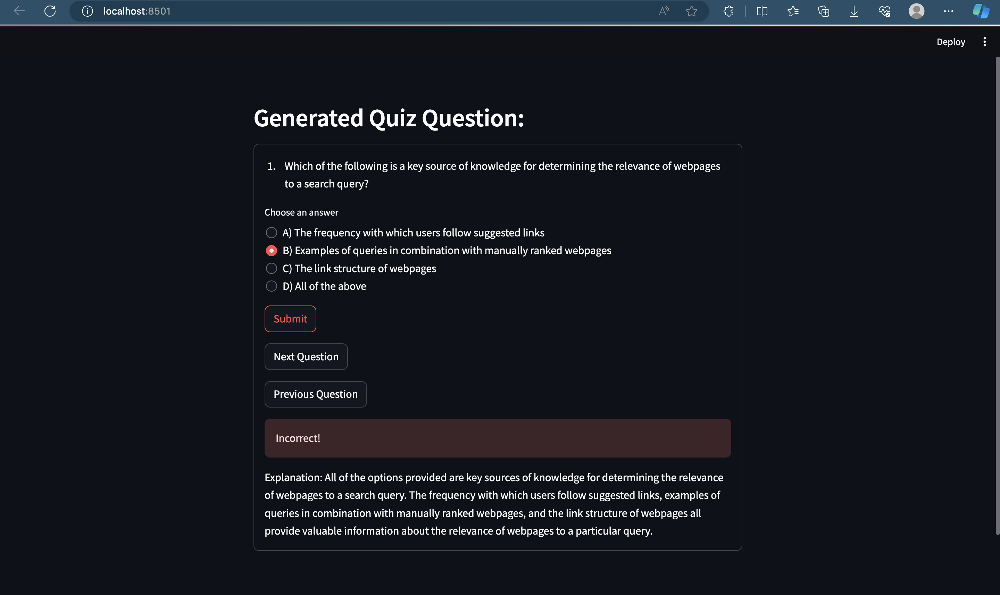
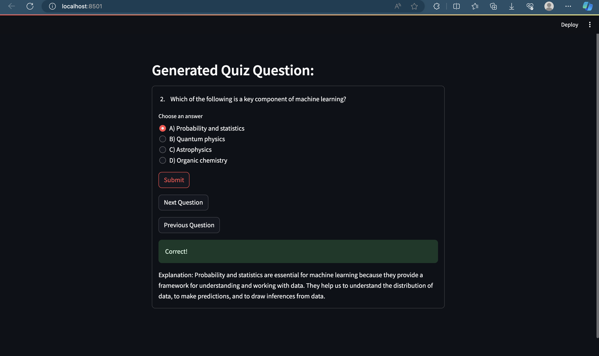

# Quizify_Gemini

## Description

Quizify_Gemini is a Streamlit web application designed to generate quiz questions based on uploaded PDF documents. It utilizes various libraries and tools for document processing, embedding, and quiz generation.



To use the application, simply upload one or more PDF documents, provide a topic, and specify the number of questions for quiz generation, then click the submit button.



You can monitor the process of quiz generation to keep track of successful and failed attempts.



Once the number of successful attempts matches the number of questions provided, check the browser. If the quiz is not loaded yet, click submit again to refresh the Streamlit app, and the quiz will pop up.





## Installation

To install the necessary dependencies, you can use the provided `requirements.txt` file. You can install them via pip:

```bash
pip install -r requirements.txt
```

## Usage

- Clone the repository to your local machine.
- Navigate to the repository directory.
- Install the dependencies using the provided requirements.txt file.
- Run the Streamlit app using the following command:

```bash
streamlit run app.py
```

## Folder Structure

- `pdf_processing` :  Contains modules for processing PDF documents.
  - `document_processor.py` : Module for processing uploaded PDF documents.
  - `embedding_client.py` : Module for embedding text queries using Google Cloud's VertexAI.
- `database` : Contains modules for creating and managing databases.
  - `chroma_collection_creator.py` : Module for creating a Chroma collection from processed documents.
- `llm_quiz_generator` : Contains modules for generating quizzes using Large Language Models (LLMs).
  - `quiz_generator.py` : Module for generating quiz questions based on a specified topic.
  - `quiz_manager.py` : Module for managing and navigating through generated quiz questions.
- `__init__.py` : This file lets you treat your package like a module. This simplifies your imports.

## Requirements

- streamlit==1.32.2
- chromadb==0.4.24
- langchain==0.1.13
- langchain-google-vertexai==0.1.2
- pypdf==4.1.0
- protobuf==4.25.3
- langchain-community==0.0.29
